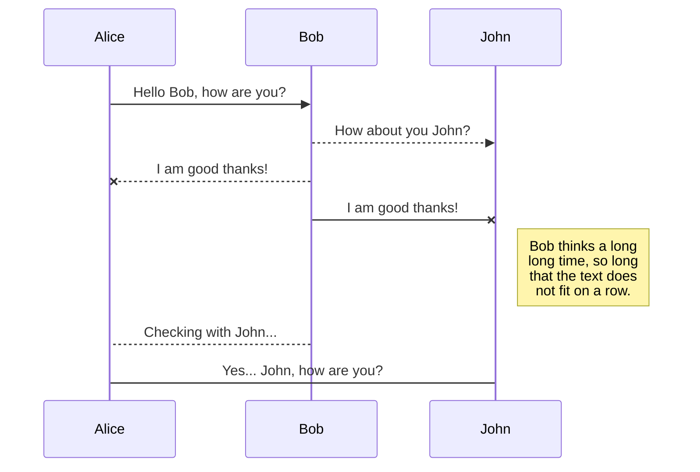
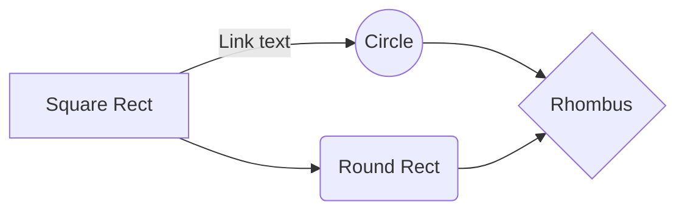

# Introduction(소개)
I worked on a project for engineering contest about 2 years ago. Since I finished the contest, I kept privately this project for 2 years because security of winning piece.
(ps. I won the grand prize!!) But now, I will share this project for **"Open Source"**.
I hope this project can be used for any good purpose(ex. study material for begineer, contributing etc..). Unfortunately, one team member  disagreed the sharing of source code that he was in charge of. So I can't share the specific part of source code

약 2년전 외부 공학 설계 경진대회를 위해 작업했던 프로젝트입니다. 제가 이 프로젝트를 마친 후로부터, 수상작에 대한 보안 목적으로 2년 동안 비공개를 하였습니다.(대상 수상작) 그러나 이제, 저는 이 프로젝트를 오픈 소스로서 공개하고자 합니다.
부디 이 프로젝트가 좋은 목적( 예를 들어 초보자를 위한 학습자료, 기여 등)에 사용되길 바랍니다.  그러나 불행하게도, 팀 멤버 중 한 명이 자신이 맡은 부분에 대한 소스 코드를 공개하는 것에 대해 동의하지 않았기에, 일부분은 공유할수 없습니다.

# Project information(정보)

- **Subject(주제)** : Home IoT control system using Smart Mirror
- **project duration(기간)** : 2019.03 ~ 2019.11
- **participants(구성원)** : 4 people
- **Tech stack(기술 스택)** : C++ , Javascript, CSS, HTML5, MQTT protocol, Jquery, Open API

# Environment(환경)
This project designed for certain environment.
**ATTN : If you want to run this project, please KEEP the environment below!!**
>- upper **Raspberry PI 3B** or **x86/64 computer**
>- Any version of operating system **Raspbian** or **Microsoft Windows**
  **(I never ran for MAC, so I'm not sure running in MAC OS.)**
>- **Google chrome** web browser
>- **Network Accessible**
>- **Display device** supporting "1024 X 764 px"
>- Programmed HW like **Arduino UNO** 
        (I uploaded firmware source code for Arduino board)
>- HW modules( Humidity, Temp, Dust sensor, Relay Module)
	**[ ATTN : You can run this program without any HW(Arduino, sensor, relay, etc). But the value of sensor does not shown on screen! ]**
	
이 프로젝트는 특정한 환경을 위해 작동되도록 설계되었습니다.
**주의 : 이 프로젝트를 제대로 실행시켜 보고자 한다면, 아래 기술되어 있는 시스템 환경을 지키시기 바랍니다.!!**
>- **Raspberry PI 3B** 또는 **x86/64 computer**, 그 이상
>-  **Raspbian** or **Microsoft Windows** 의 모든 버전
  **(MAC 운영체제에서는 시험해보지 않았기에,  MAC 운영체체에 대한 작동은 불분명합니다.)**
>- **구글 크롬** 웹 브라우저
>- **네트워크 사용가능**
>- "1024 X 764픽셀"을 제공하는 **디스플레이 장치**
>- **Arduino UNO**와 같은 프로그래밍된 하드웨어 
        (아두이노 보드를 위한 펌웨어 소스코드를 첨부하였습니다.)
>- 하드웨어 모듈( 습도,온도,미세먼지 센서, 릴레이 모듈)
	**[ 주의 : 하드웨어(아두이노, 센서, 릴레이 등) 없이도 작동시킬 수 있습니다. 그러나 센서 값이 디스플레이에 출력되지는 않을 것입니다. ]**
# Team Member
>-Mr. YH CHA (Captine/ SW part - FE, FW) - Incheon Nat'l Univ
-Mr. DH LEE (SW part - BE, FW) - Dongguk Univ
-Mr. HS HYUN ( HW part- Design, MFG )  - Sejong Univ
-Mr. JH PARK (HW part -Design, MFG ) - Hyundai 

**ATTN : Full name was hidden because private information.**

Thank you for all member !!

>-Mr. YH CHA (조장/ SW 담당 : FE, 펌웨어) - 현) 인천대학교 
>( 본 깃허브 계정 소유자 및 오픈소스 공유 )
-Mr. DH LEE (SW 담당 - 백엔드, 펌웨어) - 현) 동국대학교
-Mr. HS HYUN ( HW 담당- 설계, 제작 )  - 현) 세종대학교
-Mr. JH PARK (HW 담당- 설계, 제작 ) - 현) 현대그룹

**주의 : 실명은 개인정보에 해당하므로 공개하지 않습니다.**

이 자리를 빌어 모든 팀원들에게 감사드립니다 !!

# Tech Stack
-    This project is one of the IoT Platform consists of various field of technology stack.

		**Front End(FE)** : FE web page is located in the Smart Mirror Computer(Raspberry PI). it displayed on the Monitor screen via half glass mirror. The FE web page is designed for IoT device control command transmit, receiving data from devices and display its states graphically. And also it receives the weather information from open API(**Open weather map API**) and display it. it transmits the control command  using voice recognition API(**Annyang Speech API**). And it transmits the command using **MQTT protocol**.
--programming language : HTML5, Javascript, CSS
--Environment : Google chrome, 1024X768 RGB Display device
--Javascript Library : JQuery
--API : Open Weathermap API , Annyang Speech API
	
	 **[ ATTN : The open weathermap API needs the Serial key for use, so in the source code I attached, I blocked the API key section using the character " *** " ]**

     **Back End(BE)** : The backend server is designed for relay system.
     it's communication system is based on MQTT protocol. It receives the command signal character set from FE web page. And it converts the character set into the number, and transmits to the IoT device(Arduino). It also  receives the number data from the IoT devices, converts to the character set and transmits to the FE web page
-- Environment : Linux
**[ ATTN : I can't share the BE source code because BE part team member disagreed the sharing of BE system & source code. :( ]**
		
		
# Installation
### - 1.  
## Switch to another file

All your files and folders are presented as a tree in the file explorer. You can switch from one to another by clicking a file in the tree.

## Rename a file

You can rename the current file by clicking the file name in the navigation bar or by clicking the **Rename** button in the file explorer.

## Delete a file

You can delete the current file by clicking the **Remove** button in the file explorer. The file will be moved into the **Trash** folder and automatically deleted after 7 days of inactivity.

## Export a file

You can export the current file by clicking **Export to disk** in the menu. You can choose to export the file as plain Markdown, as HTML using a Handlebars template or as a PDF.

# Synchronization

Synchronization is one of the biggest features of StackEdit. It enables you to synchronize any file in your workspace with other files stored in your **Google Drive**, your **Dropbox** and your **GitHub** accounts. This allows you to keep writing on other devices, collaborate with people you share the file with, integrate easily into your workflow... The synchronization mechanism takes place every minute in the background, downloading, merging, and uploading file modifications.

There are two types of synchronization and they can complement each other:

- The workspace synchronization will sync all your files, folders and settings automatically. This will allow you to fetch your workspace on any other device.
	> To start syncing your workspace, just sign in with Google in the menu.

- The file synchronization will keep one file of the workspace synced with one or multiple files in **Google Drive**, **Dropbox** or **GitHub**.
	> Before starting to sync files, you must link an account in the **Synchronize** sub-menu.

## Open a file

You can open a file from **Google Drive**, **Dropbox** or **GitHub** by opening the **Synchronize** sub-menu and clicking **Open from**. Once opened in the workspace, any modification in the file will be automatically synced.

## Save a file

You can save any file of the workspace to **Google Drive**, **Dropbox** or **GitHub** by opening the **Synchronize** sub-menu and clicking **Save on**. Even if a file in the workspace is already synced, you can save it to another location. StackEdit can sync one file with multiple locations and accounts.

## Synchronize a file

Once your file is linked to a synchronized location, StackEdit will periodically synchronize it by downloading/uploading any modification. A merge will be performed if necessary and conflicts will be resolved.

If you just have modified your file and you want to force syncing, click the **Synchronize now** button in the navigation bar.

> **Note:** The **Synchronize now** button is disabled if you have no file to synchronize.

## Manage file synchronization

Since one file can be synced with multiple locations, you can list and manage synchronized locations by clicking **File synchronization** in the **Synchronize** sub-menu. This allows you to list and remove synchronized locations that are linked to your file.

# Publication

Publishing in StackEdit makes it simple for you to publish online your files. Once you're happy with a file, you can publish it to different hosting platforms like **Blogger**, **Dropbox**, **Gist**, **GitHub**, **Google Drive**, **WordPress** and **Zendesk**. With [Handlebars templates](http://handlebarsjs.com/), you have full control over what you export.

> Before starting to publish, you must link an account in the **Publish** sub-menu.

## Publish a File

You can publish your file by opening the **Publish** sub-menu and by clicking **Publish to**. For some locations, you can choose between the following formats:

- Markdown: publish the Markdown text on a website that can interpret it (**GitHub** for instance),
- HTML: publish the file converted to HTML via a Handlebars template (on a blog for example).

## Update a publication

After publishing, StackEdit keeps your file linked to that publication which makes it easy for you to re-publish it. Once you have modified your file and you want to update your publication, click on the **Publish now** button in the navigation bar.

> **Note:** The **Publish now** button is disabled if your file has not been published yet.

## Manage file publication

Since one file can be published to multiple locations, you can list and manage publish locations by clicking **File publication** in the **Publish** sub-menu. This allows you to list and remove publication locations that are linked to your file.

# Markdown extensions

StackEdit extends the standard Markdown syntax by adding extra **Markdown extensions**, providing you with some nice features.

> **ProTip:** You can disable any **Markdown extension** in the **File properties** dialog.

## SmartyPants

SmartyPants converts ASCII punctuation characters into "smart" typographic punctuation HTML entities. For example:

|                |ASCII                          |HTML                         |
|----------------|-------------------------------|-----------------------------|
|Single backticks|`'Isn't this fun?'`            |'Isn't this fun?'            |
|Quotes          |`"Isn't this fun?"`            |"Isn't this fun?"            |
|Dashes          |`-- is en-dash, --- is em-dash`|-- is en-dash, --- is em-dash|

## KaTeX

You can render LaTeX mathematical expressions using [KaTeX](https://khan.github.io/KaTeX/):

The *Gamma function* satisfying $\Gamma(n) = (n-1)!\quad\forall n\in\mathbb N$ is via the Euler integral

$$
\Gamma(z) = \int_0^\infty t^{z-1}e^{-t}dt\,.
$$

> You can find more information about **LaTeX** mathematical expressions [here](http://meta.math.stackexchange.com/questions/5020/mathjax-basic-tutorial-and-quick-reference).

## UML diagrams

You can render UML diagrams using [Mermaid](https://mermaidjs.github.io/). For example, this will produce a sequence diagram:

And this will produce a flow chart:

